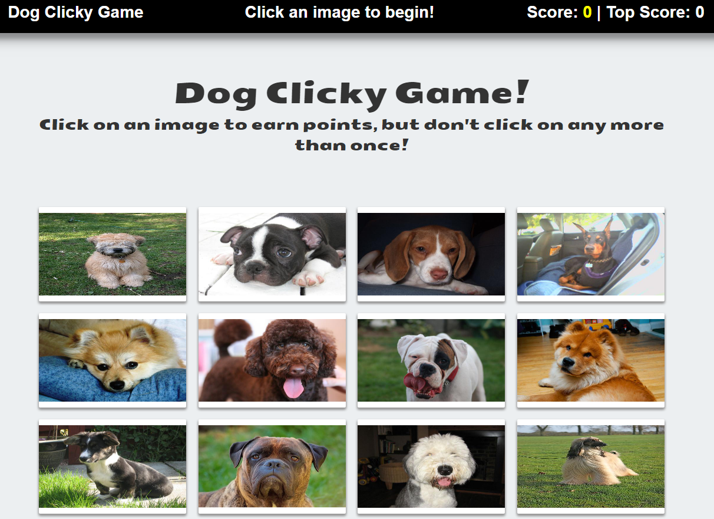

# Clicky-Game

### This application is a memory game built with React.  The application renders images of dogs and will keep track of user scores which are incremented when clicking an image for the first time.  The user's score is reset to 0 if they click the same image more than once.  The images will shuffle order after every click.  

#### Technologies used
* React
* Bootstrap
* ES6

#### App Link
https://jdowd215.github.io/Clicky-Game/
